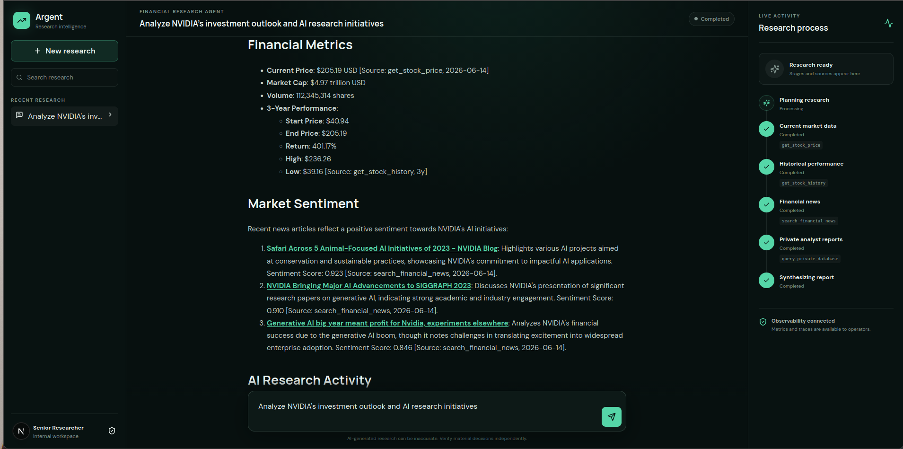
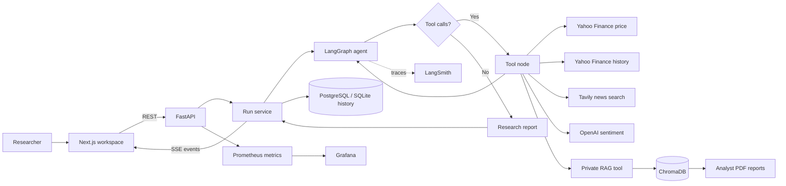
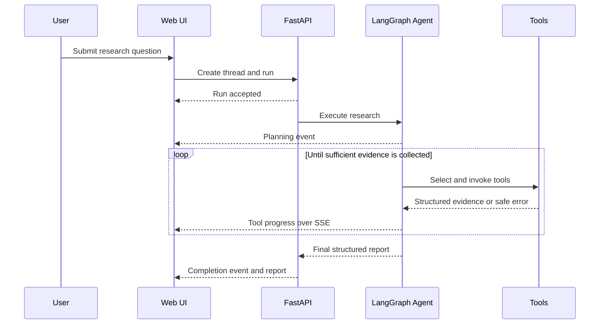

<div align="center">

# Argent

### Autonomous financial research with transparent agent execution

Argent combines live market data, financial news, sentiment analysis, and
private analyst reports into evidence-based company research. Users can follow
the agent's plan, tool calls, and report synthesis as they happen.

[](https://www.python.org/)
[](https://fastapi.tiangolo.com/)
[](https://nextjs.org/)
[](https://www.langchain.com/langgraph)
[](https://www.docker.com/)

</div>



> [!IMPORTANT]
> Argent produces informational research, not personalized financial advice.
> Verify model output and source data independently before making financial
> decisions.

## Why This Project Matters

Financial analysts work across fragmented sources: market feeds, price history,
news, sentiment signals, and proprietary strategy reports. Gathering that
evidence manually can take **4-6 hours per company**, with as much as **60-70%
of analyst time spent collecting data** instead of interpreting it.

Argent turns that disconnected workflow into one traceable research process. It
automates evidence collection and first-pass synthesis while keeping the human
informed through source citations, visible tool activity, explicit research
gaps, and confidence-qualified conclusions. The goal is not to replace analyst
judgment; it is to give that judgment better inputs, faster.

## Architecture At A Glance

| Layer | Responsibility |
| --- | --- |
| **Next.js workspace** | Accepts research questions and displays live agent progress, reports, and prior research |
| **FastAPI service** | Manages threads and runs, streams SSE events, exposes health checks and Prometheus metrics |
| **LangGraph agent** | Plans the research workflow, selects tools, handles recoverable failures, and synthesizes the report |
| **Research tools** | Retrieve market prices, historical performance, financial news, sentiment, and private analyst evidence |
| **Data layer** | Stores run history in PostgreSQL and vectorized private reports in ChromaDB |
| **Observability** | Uses Prometheus, Grafana, structured logging, and optional LangSmith tracing |

```text
Researcher -> Next.js -> FastAPI -> LangGraph -> Financial and RAG tools
                ^           |            |
                |           v            v
                +-- SSE -- PostgreSQL   ChromaDB
                            |
                     Prometheus/Grafana
```

## What It Does

Users submit a company analysis or comparison through a browser workspace. A
LangGraph agent decides which tools are needed, gathers evidence, handles
recoverable tool failures, and writes a structured research report.

For a full company analysis, the agent can:

1. Retrieve current price, volume, and market capitalization.
2. Calculate historical performance over a requested period, typically three
   years.
3. Search recent financial news.
4. Measure sentiment from the retrieved material.
5. Retrieve company AI initiatives from private PDF reports through RAG.
6. Synthesize financial metrics, sentiment, opportunities, risks, research
   gaps, and a confidence-qualified research view.

## Features

- **Autonomous tool orchestration** with LangGraph conditional routing
- **Five research tools** for price, history, news, sentiment, and private RAG
- **Grounded private-document answers** with source citations
- **Live execution visibility** through Server-Sent Events (SSE)
- **Persistent research history** using PostgreSQL in production or SQLite locally
- **Graceful degradation** when individual tools or providers fail
- **Structured research reports** with risks, opportunities, gaps, and
  confidence
- **Prompt profiles** for traditional, basic, and full autonomous behavior
- **Operational metrics** for runs, duration, tool calls, and SSE connections
- **LangSmith tracing** through environment configuration
- **Production containers** for the API and Next.js frontend
- **Prometheus and Grafana** monitoring configuration

## Architecture



### Agent Loop



## RAG Pipeline

Private company reports are processed as follows:

```text
PDF or ZIP archive
  -> safe extraction
  -> PDF page loading
  -> token-aware chunking (1,000 tokens, 200 overlap by default)
  -> OpenAI embeddings
  -> persistent Chroma collection
  -> semantic top-k retrieval
  -> grounded answer with document citations
```

The current sample corpus covers Amazon, Alphabet, IBM, Microsoft, and NVIDIA.
Source documents and generated indexes are intentionally excluded from Git.

## Tech Stack

| Area | Technologies |
| --- | --- |
| Agent and LLM | LangGraph, LangChain, OpenAI |
| Financial data | yfinance / Yahoo Finance |
| News | Tavily Search |
| Retrieval | ChromaDB, OpenAI embeddings, PyPDF, tiktoken |
| Backend | Python, FastAPI, Pydantic, SSE |
| Persistence | PostgreSQL in production, SQLite locally, ChromaDB for vectors |
| Frontend | Next.js, React, TypeScript, React Markdown, Lucide |
| Observability | Prometheus, Grafana, LangSmith, structured logging |
| Deployment | Docker, Docker Compose, Nginx |
| Testing | pytest, HTTPX, ESLint, TypeScript |

## Repository Structure

```text
Agentic_RAG/
├── app/
│   ├── agent/              # LangGraph, prompts, state, and agent nodes
│   ├── api/                # FastAPI routes, schemas, run service, and stores
│   ├── rag/                # Loading, splitting, embedding, indexing, retrieval
│   ├── tools/              # Market, news, sentiment, and private RAG tools
│   ├── tests/              # Unit, workflow, API, retrieval, and live tests
│   ├── config.py           # Environment-backed configuration
│   └── main.py             # FastAPI application entry point
├── frontend/
│   ├── app/                # Next.js workspace and styling
│   └── lib/                # Typed API client and shared types
├── deploy/
│   ├── grafana/            # Provisioned dashboards and data source
│   ├── prometheus/         # Metrics scraping configuration
│   └── nginx.conf          # Production reverse proxy
├── docs/                   # Project documentation and local source archive
├── Dockerfile
├── compose.yml
├── requirements.txt
└── .env.example
```

## Local Installation

### Prerequisites

- Python 3.12 or newer
- Node.js 20.9 or newer
- OpenAI API credentials
- Tavily API credentials for live news search

### 1. Clone the repository

```bash
git clone https://github.com/sebtosca/Financial_Research_Agent.git
cd Financial_Research_Agent
```

### 2. Install the Python dependencies

```bash
python -m venv .venv
source .venv/bin/activate
python -m pip install --upgrade pip
python -m pip install -r requirements.txt
```

Using an existing Python environment is also supported; the virtual environment
is recommended to isolate dependencies.

### 3. Configure the environment

```bash
cp .env.example .env
```

At minimum, configure:

```env
OPENAI_API_KEY=your-openai-key
OPENAI_API_BASE=
OPENAI_MODEL=gpt-4o-mini

TAVILY_API_KEY=your-tavily-key

APP_CORS_ORIGINS=http://localhost:3000
RUN_STORE_PATH=./data/research_history.sqlite3
DATABASE_URL=

DOCS_PATH=./app/docs
ZIP_FILE=./docs/Companies-AI-Initiatives.zip
CHROMA_DB_DIR=./chroma_db
```

When `DATABASE_URL` is set, the API stores threads, runs, events, and
cancellation state in PostgreSQL. When it is empty, local development falls
back to SQLite at `RUN_STORE_PATH`.

LangSmith tracing is optional:

```env
LANGCHAIN_TRACING_V2=true
LANGCHAIN_API_KEY=your-langsmith-key
LANGCHAIN_PROJECT=financial-research-agent
```

### 4. Build the private RAG index

Place PDF files below `DOCS_PATH`, or provide the ZIP archive configured by
`ZIP_FILE`, then run:

```bash
python -m app.rag.index
```

The command safely extracts the archive when necessary and persists the Chroma
index at `CHROMA_DB_DIR`. Rebuild the index whenever the source corpus changes.

### 5. Start the backend

```bash
uvicorn app.main:app --reload --host 127.0.0.1 --port 8000
```

- API: `http://localhost:8000`
- OpenAPI documentation: `http://localhost:8000/docs`
- Metrics: `http://localhost:8000/metrics`
- Health: `http://localhost:8000/api/v1/health/live`

### 6. Start the frontend

In another terminal:

```bash
cd frontend
npm ci
npm run dev
```

Open `http://localhost:3000`.

## Example Queries

- `Analyze NVIDIA's investment outlook and AI research initiatives.`
- `Compare Microsoft and Google across AI strategy and market sentiment.`
- `Assess Amazon's three-year performance and current AI opportunities.`
- `Which company has the most innovative AI research? Provide evidence.`
- `Rank MSFT, GOOGL, NVDA, AMZN, and IBM by financial strength and AI positioning.`

## API Workflow

The frontend uses the same public API available to other clients:

```bash
# Create a research thread
curl -X POST http://localhost:8000/api/v1/threads \
  -H 'Content-Type: application/json' \
  -d '{"title":"NVIDIA research"}'

# Start a run using the returned thread ID
curl -X POST http://localhost:8000/api/v1/threads/THREAD_ID/runs \
  -H 'Content-Type: application/json' \
  -d '{"query":"Analyze NVIDIA and its AI initiatives","with_rag":true}'

# Stream progress using the returned run ID
curl -N http://localhost:8000/api/v1/runs/RUN_ID/events
```

## Testing

Run deterministic tests without external provider calls:

```bash
pytest -q -m "not integration"
```

Run the live integration suite only when API credentials and network access are
available:

```bash
pytest -q -m integration
```

Validate the frontend:

```bash
cd frontend
npm run typecheck
npm run lint
npm run build
```

The deterministic suite currently covers agent configuration, tool-error
handling, API lifecycle behavior, SQLite persistence, RAG safety checks, golden
retrieval queries, indexing, prompts, and multi-tool workflow synthesis. No
accuracy or groundedness score is published yet; those metrics require a
versioned evaluation dataset and repeatable evaluation pipeline.

## Observability

The backend exposes these Prometheus metrics:

- `financial_agent_runs_total{status}`
- `financial_agent_active_runs`
- `financial_agent_run_duration_seconds`
- `financial_agent_tool_calls_total{tool,status}`
- `financial_agent_sse_connections`

Grafana is provisioned with an agent overview dashboard. LangSmith can capture
LLM and LangGraph traces when its environment variables are enabled. The
frontend presents user-facing execution stages, while Grafana, Prometheus, and
LangSmith remain operator tools and are not exposed directly in the browser UI.

## Docker Deployment

Create and configure `.env`. Keep the private source archive at
`docs/Companies-AI-Initiatives.zip`, then build the stack:

```bash
docker compose build
docker compose up -d
```

The one-shot `rag-indexer` service builds the shared Chroma volume before the
API starts. Existing indexes are reused unless `RAG_REBUILD_INDEX=true` is set.
The API automatically initializes its PostgreSQL tables during startup.

Services:

| Service | Address |
| --- | --- |
| Web workspace | `http://localhost/` |
| API documentation through Nginx | `http://localhost/backend/docs` |
| Grafana | `http://127.0.0.1:3001` |
| Prometheus | `http://127.0.0.1:9090` |

Prometheus and Grafana bind to localhost by default. Use a secured reverse proxy
or SSH tunnel for remote operator access.

## Current Limitations

- Research output depends on third-party data availability and model quality.
- Docker Compose uses PostgreSQL for durable run history. Local development
  defaults to SQLite unless `DATABASE_URL` is configured.
- LangGraph conversational checkpoints use in-process memory and do not survive
  an API restart; completed reports and run history do survive in the selected
  database.
- Live SSE subscriptions and agent execution remain process-local, so the
  current deployment should run one API replica until execution is moved to a
  worker and events are distributed through a broker.
- Authentication and role-based access control are not implemented.
- The current RAG retriever uses semantic similarity without a reranker or
  hybrid lexical search.
- The repository does not yet publish benchmark scores for answer accuracy,
  groundedness, retrieval recall, or production latency.

## Roadmap

- [ ] Move long-running agent execution to a durable worker queue
- [ ] Add authentication and role-based access control
- [ ] Add a versioned RAG evaluation dataset and Ragas-style evaluation
- [ ] Add hybrid retrieval, reranking, and document-level access controls
- [ ] Add token, model-cost, and retrieval-quality metrics
- [ ] Add CI/CD security, test, and container scanning workflows
- [ ] Add SEC filings, earnings reports, and additional market-data providers
- [ ] Add portfolio-level comparisons and exportable reports


## License

No license file has been added yet. Until a license is selected, the repository
should be treated as all rights reserved by its owner.
