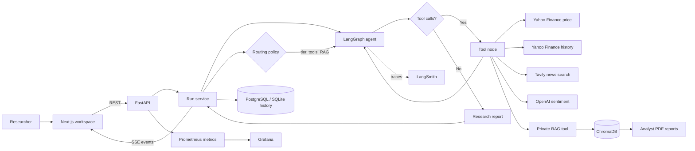
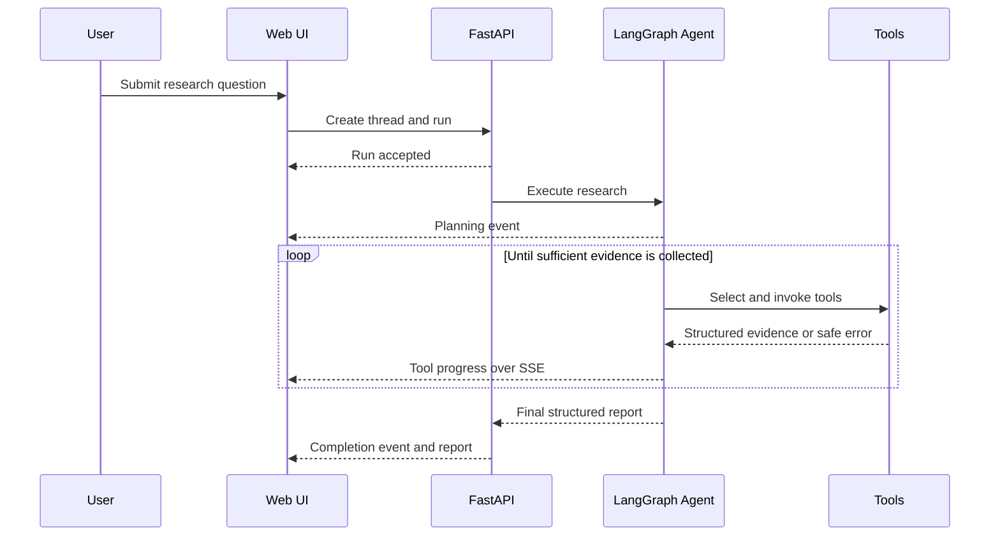

<div align="center">

# Argent

### Autonomous financial research with transparent agent execution

Argent combines live market data, financial news, sentiment analysis, and
private analyst reports into evidence-based company research. Users can follow
the agent's plan, tool calls, and report synthesis as they happen.

[](https://www.python.org/)
[](https://fastapi.tiangolo.com/)
[](https://nextjs.org/)
[](https://www.langchain.com/langgraph)
[](https://www.docker.com/)

</div>


> [!IMPORTANT]
> Argent produces informational research, not personalized financial advice.
> Verify model output and source data independently before making financial
> decisions.

## Why This Project Matters

Financial analysts work across fragmented sources: market feeds, price history,
news, sentiment signals, and proprietary strategy reports. Gathering that
evidence manually can take **4-6 hours per company**, with as much as **60-70%
of analyst time spent collecting data** instead of interpreting it.

Argent turns that disconnected workflow into one traceable research process. It
automates evidence collection and first-pass synthesis while keeping the human
informed through source citations, visible tool activity, explicit research
gaps, and confidence-qualified conclusions. The goal is not to replace analyst
judgment; it is to give that judgment better inputs, faster.

## Architecture At A Glance

| Layer | Responsibility |
| --- | --- |
| **Next.js workspace** | Accepts research questions and displays live agent progress, reports, and prior research |
| **FastAPI service** | Manages threads and runs, streams SSE events, exposes health checks and Prometheus metrics |
| **LangGraph agent** | Plans the research workflow, selects tools, handles recoverable failures, and synthesizes the report |
| **Research tools** | Retrieve market prices, historical performance, financial news, sentiment, and private analyst evidence |
| **Data layer** | Stores run history in PostgreSQL and vectorized private reports in ChromaDB |
| **Observability** | Uses Prometheus, Grafana, structured logging, and optional LangSmith tracing |

```text
Researcher -> Next.js -> FastAPI -> LangGraph -> Financial and RAG tools
                ^           |            |
                |           v            v
                +-- SSE -- PostgreSQL   ChromaDB
                            |
                     Prometheus/Grafana
```

## What It Does

Users submit a company analysis or comparison through a browser workspace. A
LangGraph agent decides which tools are needed, gathers evidence, handles
recoverable tool failures, and writes a structured research report.

For a full company analysis, the agent can:

1. Retrieve current price, volume, and market capitalization.
2. Calculate historical performance over a requested period, typically three
   years.
3. Search recent financial news.
4. Measure sentiment from the retrieved material.
5. Retrieve company AI initiatives from private PDF reports through RAG.
6. Synthesize financial metrics, sentiment, opportunities, risks, research
   gaps, and a confidence-qualified research view.

## Features

- **Autonomous tool orchestration** with LangGraph conditional routing
- **Five research tools** for price, history, news, sentiment, and private RAG
- **Grounded private-document answers** with source citations
- **Live execution visibility** through Server-Sent Events (SSE)
- **Persistent research history** using PostgreSQL in production or SQLite locally
- **Graceful degradation** when individual tools or providers fail
- **Structured research reports** with risks, opportunities, gaps, and
  confidence
- **Prompt profiles** for traditional, basic, and full autonomous behavior
- **Operational metrics** for runs, duration, tool calls, and SSE connections
- **LangSmith tracing** through environment configuration
- **Production containers** for the API and Next.js frontend
- **Prometheus and Grafana** monitoring configuration

## Architecture



### Agent Loop



### Policy-Based Routing

Before invoking the agent, each run is classified by an LLM-based routing
policy (`app/routing/policy.py`) that decides:

- **Model tier**: `fast` (e.g. `gpt-4o-mini`) for narrow factual lookups, or
  `capable` (e.g. `gpt-4o`) for comparison/full-analysis queries.
- **Tool subset**: a narrower tool set for simple queries (e.g. just
  `get_stock_price` for a plain price lookup) versus the full tool set for
  research-style queries.
- **RAG engagement**: whether the private-database tool is included, subject
  to the caller's `with_rag` flag as a hard off-switch.

The classifier itself always runs on the cheap `fast`-tier model with
structured output, regardless of which tier it ultimately routes the query
to, so the extra classification call stays low-cost. If classification fails
for any reason (timeout, provider error), routing falls back to a safe
maximal default -- capable tier, full tool set -- the same graceful-
degradation pattern used by the sentiment-analysis tool's keyword fallback.

The decision is persisted on the run record (`model_tier`, `provider`,
`model_name`, `tool_subset`, `rag_engaged`) and emitted as a `routing.decided`
SSE event -- including the classifier's one-sentence reasoning -- before any
tool activity, so it's auditable the same way tool calls are. Set
`ROUTING_ENABLED=false` to bypass the classifier entirely and restore the
legacy behavior (always the full tool set, single model, no extra LLM call).

Classification logic (structured-output parsing, fallback behavior) is unit
tested offline with an injectable fake model; a small `live`-marked test
suite (`app/tests/test_routing_policy_live.py`) verifies the real classifier
against realistic phrasing when `RUN_LIVE_AGENT_TESTS=true`.

### Durable Worker Queue

Set `REDIS_URL` to move agent execution off the API process and onto a
separate `worker` process (`app/worker.py`, an `arq` task queue): `POST
.../runs` enqueues a job instead of running it via FastAPI's in-process
`BackgroundTasks`, so a queued run survives an API restart and multiple API
replicas can safely share one pool of workers. SSE event delivery fans out
through Redis pub/sub (`app/api/event_fanout.py`) rather than an in-process
queue, so a client subscribed to one API replica still receives events for a
run executing on a different worker process -- the `RunStore` interface
(`subscribe`/`unsubscribe`/`append_event`) is unchanged, this is purely an
internal implementation swap. Leave `REDIS_URL` empty to keep the original
single-process behavior (execution via `BackgroundTasks`, SSE fan-out
in-process) with no code changes needed -- useful for local development
without a Redis instance running.

```bash
docker compose up -d redis worker api
```

The LangGraph conversational checkpointer is not yet Redis-backed (still
`MemorySaver`, in-process) -- see Current Limitations and Roadmap.

## RAG Pipeline

Private company reports are processed as follows:

```text
PDF or ZIP archive
  -> safe extraction
  -> PDF page loading
  -> token-aware chunking (1,000 tokens, 200 overlap by default)
  -> OpenAI embeddings
  -> persistent Chroma collection
  -> semantic top-k retrieval
  -> grounded answer with document citations
```

The current sample corpus covers Amazon, Alphabet, IBM, Microsoft, and NVIDIA.
Source documents and generated indexes are intentionally excluded from Git.

## Tech Stack

| Area | Technologies |
| --- | --- |
| Agent and LLM | LangGraph, LangChain, OpenAI |
| Financial data | yfinance / Yahoo Finance |
| News | Tavily Search |
| Retrieval | ChromaDB, OpenAI embeddings, PyPDF, tiktoken |
| Backend | Python, FastAPI, Pydantic, SSE |
| Persistence | PostgreSQL in production, SQLite locally, ChromaDB for vectors |
| Task queue | arq, Redis (optional -- see Durable Worker Queue below) |
| Frontend | Next.js, React, TypeScript, React Markdown, Lucide |
| Observability | Prometheus, Grafana, LangSmith, structured logging |
| Deployment | Docker, Docker Compose, Nginx |
| Testing | pytest, HTTPX, ESLint, TypeScript |
| CI/CD | GitHub Actions, Trivy (dependency + container scanning), GHCR |

## Repository Structure

```text
Agentic_RAG/
├── app/
│   ├── agent/              # LangGraph, prompts, state, and agent nodes
│   ├── api/                # FastAPI routes, schemas, run service, and stores
│   ├── rag/                # Loading, splitting, embedding, indexing, retrieval
│   ├── tools/              # Market, news, sentiment, and private RAG tools
│   ├── tests/              # Unit, workflow, API, retrieval, and live tests
│   ├── config.py           # Environment-backed configuration
│   └── main.py             # FastAPI application entry point
├── frontend/
│   ├── app/                # Next.js workspace and styling
│   └── lib/                # Typed API client and shared types
├── deploy/
│   ├── grafana/            # Provisioned dashboards and data source
│   ├── prometheus/         # Metrics scraping configuration
│   └── nginx.conf          # Production reverse proxy
├── docs/                   # Project documentation and local source archive
├── Dockerfile
├── compose.yml
├── requirements.txt
└── .env.example
```

## Local Installation

### Prerequisites

- Python 3.12 or newer
- Node.js 20.9 or newer
- OpenAI API credentials
- Tavily API credentials for live news search

### 1. Clone the repository

```bash
git clone https://github.com/sebtosca/Financial_Research_Agent.git
cd Financial_Research_Agent
```

### 2. Install the Python dependencies

```bash
python -m venv .venv
source .venv/bin/activate
python -m pip install --upgrade pip
python -m pip install -r requirements.txt
```

Using an existing Python environment is also supported; the virtual environment
is recommended to isolate dependencies.

### 3. Configure the environment

```bash
cp .env.example .env
```

At minimum, configure:

```env
OPENAI_API_KEY=your-openai-key
OPENAI_API_BASE=
OPENAI_MODEL=gpt-4o-mini

TAVILY_API_KEY=your-tavily-key

APP_CORS_ORIGINS=http://localhost:3000
RUN_STORE_PATH=./data/research_history.sqlite3
DATABASE_URL=

DOCS_PATH=./app/docs
ZIP_FILE=./docs/Companies-AI-Initiatives.zip
CHROMA_DB_DIR=./chroma_db
```

When `DATABASE_URL` is set, the API stores threads, runs, events, and
cancellation state in PostgreSQL. When it is empty, local development falls
back to SQLite at `RUN_STORE_PATH`.

LangSmith tracing is optional:

```env
LANGCHAIN_TRACING_V2=true
LANGCHAIN_API_KEY=your-langsmith-key
LANGCHAIN_PROJECT=financial-research-agent
```

### 4. Build the private RAG index

Place PDF files below `DOCS_PATH`, or provide the ZIP archive configured by
`ZIP_FILE`, then run:

```bash
python -m app.rag.index
```

The command safely extracts the archive when necessary and persists the Chroma
index at `CHROMA_DB_DIR`. Rebuild the index whenever the source corpus changes.

### 5. Start the backend

```bash
uvicorn app.main:app --reload --host 127.0.0.1 --port 8000
```

- API: `http://localhost:8000`
- OpenAPI documentation: `http://localhost:8000/docs`
- Metrics: `http://localhost:8000/metrics`
- Health: `http://localhost:8000/api/v1/health/live`

### 6. Start the frontend

In another terminal:

```bash
cd frontend
npm ci
npm run dev
```

Open `http://localhost:3000`.

## Example Queries

- `Analyze NVIDIA's investment outlook and AI research initiatives.`
- `Compare Microsoft and Google across AI strategy and market sentiment.`
- `Assess Amazon's three-year performance and current AI opportunities.`
- `Which company has the most innovative AI research? Provide evidence.`
- `Rank MSFT, GOOGL, NVDA, AMZN, and IBM by financial strength and AI positioning.`

## API Workflow

The frontend uses the same public API available to other clients:

```bash
# Create a research thread
curl -X POST http://localhost:8000/api/v1/threads \
  -H 'Content-Type: application/json' \
  -d '{"title":"NVIDIA research"}'

# Start a run using the returned thread ID
curl -X POST http://localhost:8000/api/v1/threads/THREAD_ID/runs \
  -H 'Content-Type: application/json' \
  -d '{"query":"Analyze NVIDIA and its AI initiatives","with_rag":true}'

# Stream progress using the returned run ID
curl -N http://localhost:8000/api/v1/runs/RUN_ID/events
```

## Testing

Run deterministic tests without external provider calls:

```bash
pytest -q -m "not integration"
```

Run the live integration suite only when API credentials and network access are
available:

```bash
pytest -q -m integration
```

### Continuous Integration

`.github/workflows/ci.yml` runs on every pull request and push to `main`:
deterministic backend tests, frontend typecheck/lint/build, a Trivy filesystem
scan of dependencies, and a Docker image build + Trivy image scan (fails on
CRITICAL findings, exceptions tracked in `.trivyignore`). On `main`, both
images are pushed to `ghcr.io`. `.github/workflows/nightly.yml` runs the live
integration/`slow` suite on a schedule (never on pull requests, so real API
keys stay out of PR/fork reach). `.github/workflows/eval.yml` runs the
evaluation harness (`python -m app.eval.run --full-agent --judge llm`) weekly
and uploads the report as a build artifact -- kept out of default CI since it
costs real API money. Requiring these checks before merge is configured via
GitHub branch protection (repository settings, not tracked in this repo).

Validate the frontend:

```bash
cd frontend
npm run typecheck
npm run lint
npm run build
```

The deterministic suite currently covers agent configuration, tool-error
handling, API lifecycle behavior, SQLite persistence, RAG safety checks, golden
retrieval queries, indexing, prompts, and multi-tool workflow synthesis.

### Evaluation harness

A versioned golden dataset and evaluation pipeline live in `app/eval/`
(`EVAL_DATASET_VERSION = "v1"`, ~10 cases spanning price/history/news/
sentiment lookups, private-RAG queries, and full research/comparison
requests). It measures:

- **Tool-selection/trajectory accuracy** -- precision/recall/F1 of actual
  vs. expected tool calls, and whether RAG engagement matched expectations.
- **Groundedness/relevance** -- a zero-cost heuristic (vocabulary overlap)
  runs by default; an opt-in LLM-as-judge path gives richer signal.
- **Latency/cost** -- captured per run via Prometheus and persisted on the
  run record (see Observability below).

Run it directly:

```bash
python -m app.eval.run                          # routing-only, cheap
python -m app.eval.run --full-agent --judge llm  # full pipeline, real cost
python -m app.eval.run --report json
```

This is a live evaluation against real providers (requires
`OPENAI_API_KEY`, and `TAVILY_API_KEY` for news-touching cases) and is
intentionally separate from the pytest suite so it can be invoked directly
from a CI job later without redesign. The scoring math itself (precision/
recall, heuristic overlap, judge-response parsing) is unit tested offline
with synthetic inputs; a `live`-marked suite (`test_eval_live.py`) exercises
the real classifier/agent/judge end to end.

### Multi-provider chat/embedding models

Chat and embedding models are built through a small provider factory
(`app/providers/`) instead of being hardcoded to OpenAI. Set `CHAT_PROVIDER`
(or a per-tool override such as `SENTIMENT_PROVIDER`/`PRIVATE_DATABASE_PROVIDER`)
and `EMBEDDING_PROVIDER` to `openai`, `anthropic`, or `google`. OpenAI is the
only provider exercised against a live API in this repo today; Anthropic and
Google adapters are implemented and covered by offline dispatch/config tests
only. To use them for real, install the optional adapters and set the
matching API key:

```bash
pip install -r requirements-optional.txt
```

## Observability

The backend exposes these Prometheus metrics:

- `financial_agent_runs_total{status}`
- `financial_agent_active_runs`
- `financial_agent_run_duration_seconds`
- `financial_agent_tool_calls_total{tool,status}`
- `financial_agent_tool_call_duration_seconds{tool}`
- `financial_agent_sse_connections`
- `financial_agent_routing_decisions_total{model_tier}`
- `financial_agent_llm_tokens_total{model,direction}`
- `financial_agent_llm_cost_usd_total{model}` (approximate -- see
  `app/providers/pricing.py`)

Per-run token counts and estimated cost are also persisted on the run record
(`prompt_tokens`, `completion_tokens`, `estimated_cost_usd`), captured from
each LLM response's `usage_metadata` -- the same field LangChain populates
consistently across OpenAI/Anthropic/Google, so cost tracking needs no
per-provider branching.

Grafana is provisioned with an agent overview dashboard. The frontend presents
user-facing execution stages, while Grafana, Prometheus, and LangSmith remain
operator tools and are not exposed directly in the browser UI.

### LangSmith production tracing

When `LANGCHAIN_TRACING_V2=true`, every run is explicitly tagged and named
(not just auto-instrumented) via `app/observability/tracing.py`: each trace
carries `model_tier:<tier>`, `provider:<provider>`, and `rag_engaged:<bool>`
tags plus `run_id`/`thread_id`/`matched_rules` metadata, so traces are
filterable in the LangSmith UI by routing decision, not just an opaque blob
per run. The trace's root run id is captured synchronously (via an explicit
`LangChainTracer` callback, not just the global env-var auto-patch) and
persisted as `RunRecord.langsmith_run_id`, so a run can be linked directly to
its trace.

`POST /api/v1/runs/{run_id}/feedback` persists feedback locally regardless of
LangSmith (`FeedbackRecord`, stored alongside runs/events), and additionally
forwards it to the run's LangSmith trace via `Client().create_feedback(...)`
when tracing is enabled and the run has a captured trace id. LangSmith
submission failures are logged and swallowed -- local persistence is the
source of truth, LangSmith is best-effort. Set `LANGSMITH_FEEDBACK_ENABLED=false`
to disable the LangSmith forwarding while keeping local feedback persistence.

## Docker Deployment

Create and configure `.env`. Keep the private source archive at
`docs/Companies-AI-Initiatives.zip`, then build the stack:

```bash
docker compose build
docker compose up -d
```

The one-shot `rag-indexer` service builds the shared Chroma volume before the
API starts. Existing indexes are reused unless `RAG_REBUILD_INDEX=true` is set.
The API automatically initializes its PostgreSQL tables during startup.

Services:

| Service | Address |
| --- | --- |
| Web workspace | `http://localhost/` |
| API documentation through Nginx | `http://localhost/backend/docs` |
| Grafana | `http://127.0.0.1:3001` |
| Prometheus | `http://127.0.0.1:9090` |

Prometheus and Grafana bind to localhost by default. Use a secured reverse proxy
or SSH tunnel for remote operator access.

## Current Limitations

- Research output depends on third-party data availability and model quality.
- Docker Compose uses PostgreSQL for durable run history. Local development
  defaults to SQLite unless `DATABASE_URL` is configured.
- LangGraph conversational checkpoints still use in-process memory and do not
  survive a process restart mid-conversation (a known follow-up now that a
  durable worker exists -- see Architecture below); completed reports and run
  history always survive in the selected database regardless.
- Authentication and role-based access control are not implemented.
- The current RAG retriever uses semantic similarity without a reranker or
  hybrid lexical search.
- The repository does not yet publish benchmark scores for answer accuracy,
  groundedness, retrieval recall, or production latency.

## Roadmap

- [x] Move long-running agent execution to a durable worker queue
- [ ] Move the LangGraph conversational checkpointer to Redis (currently in-process `MemorySaver`)
- [ ] Add authentication and role-based access control
- [ ] Add a versioned RAG evaluation dataset and Ragas-style evaluation
- [ ] Add hybrid retrieval, reranking, and document-level access controls
- [ ] Add token, model-cost, and retrieval-quality metrics
- [x] Add CI/CD security, test, and container scanning workflows
- [ ] Add SEC filings, earnings reports, and additional market-data providers
- [ ] Add portfolio-level comparisons and exportable reports


## License

No license file has been added yet. Until a license is selected, the repository
should be treated as all rights reserved by its owner.
